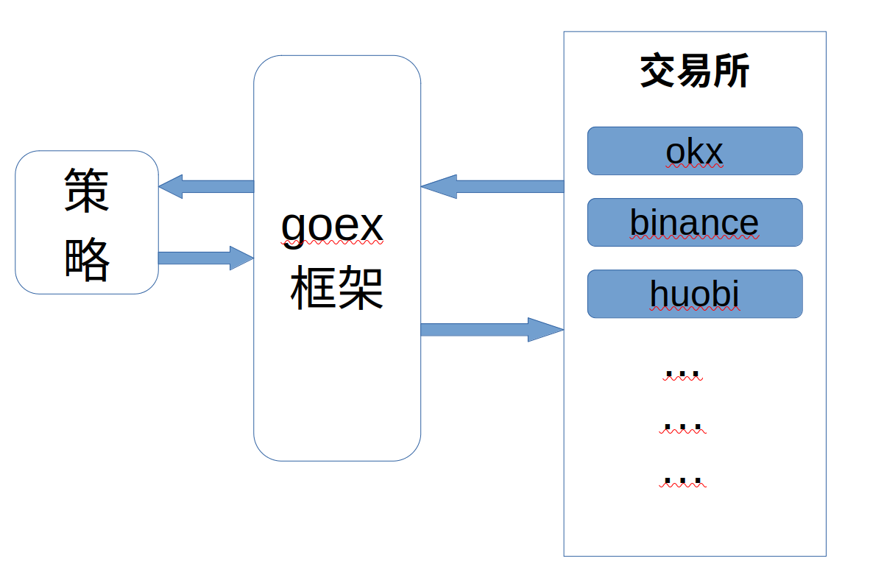

### Introduction
* Unified and standardize the interfaces of various cryptocurrency trading platforms.



### Donate
* [BTC] 1GoEXwVvXG7kNdQSFaUNF35A3izHojLGxP
* [USDT-TRC20] TGoExC6xvzE4wSA9cYZnwcPaXEjibA5Vtc

### Example

```golang
package main

import (
	goexv2 "github.com/nntaoli-project/goex/v2"
	"github.com/nntaoli-project/goex/v2/logger"
	"github.com/nntaoli-project/goex/v2/model"
	"github.com/nntaoli-project/goex/v2/options"
	"log"
)

func main() {
	logger.SetLevel(logger.DEBUG)                             //设置日志输出级别
	// goexv2.DefaultHttpCli.SetProxy("socks5://127.0.0.1:8080") //socks代理
	goexv2.DefaultHttpCli.SetTimeout(5)                       // 5 second

	_, _, err := goexv2.OKx.Spot.GetExchangeInfo() //建议调用
	if err != nil {
		panic(err)
	}
	btcUSDTCurrencyPair, err := goexv2.OKx.Spot.NewCurrencyPair(model.BTC, model.USDT) //建议这样构建CurrencyPair
	if err != nil {
		panic(err)
	}

	// 共有api调用，交易对的基本信息
	log.Println(goexv2.OKx.Spot.GetTicker(btcUSDTCurrencyPair))
	// 获取当前市场价格
	klines, _, err := goexv2.OKx.Spot.GetKline(btcUSDTCurrencyPair, model.Kline_1min)
	if err != nil {
		panic(err)
	}
	priceNow := klines[0].Close

	// 私有API调用
	okxPrvApi := goexv2.OKx.Spot.NewPrvApi(
		options.WithApiKey(""),
		options.WithApiSecretKey(""),
		options.WithPassphrase(""),
		options.WithSimulated())

	account, _, err := okxPrvApi.GetAccount()
	if err != nil {
		return
	}
	log.Println(account)
	
	// 以市场价 0.9倍价格 下买单，不会成交
	order, _, err := okxPrvApi.CreateOrder(btcUSDTCurrencyPair, 0.01, priceNow*0.9, model.Spot_Buy, model.OrderType_Limit)
	log.Println(err)
	log.Println(order)
	// 撤回订单
	cancelOrder, err := okxPrvApi.CancelOrder(btcUSDTCurrencyPair, order.Id)
	if err != nil {
		panic(err)
	}
	log.Println(string(cancelOrder))
}

```

### Thanks
<a href="https://www.jetbrains.com/?from=goex"></a>

